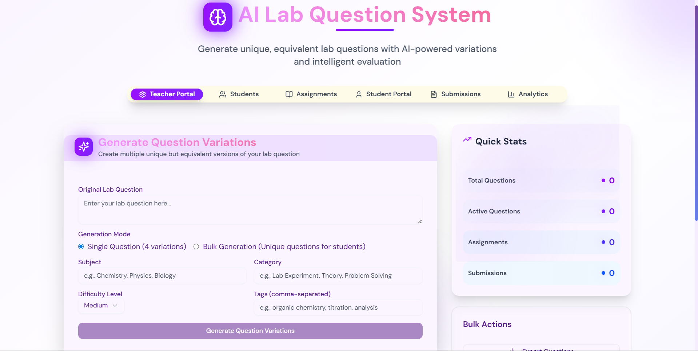
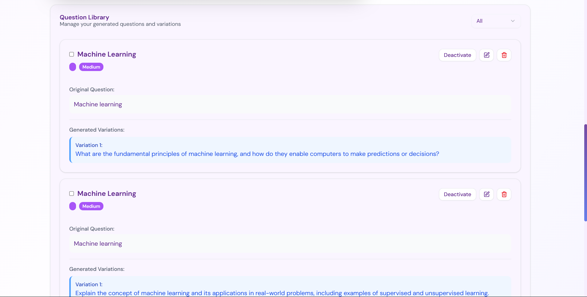
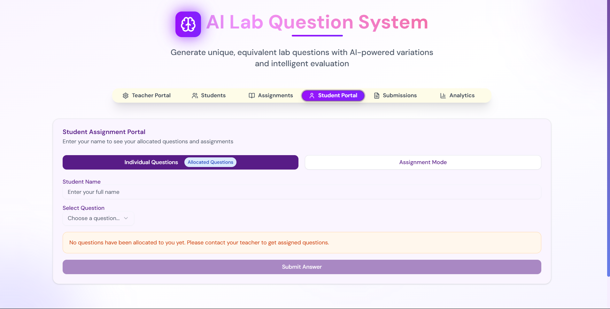
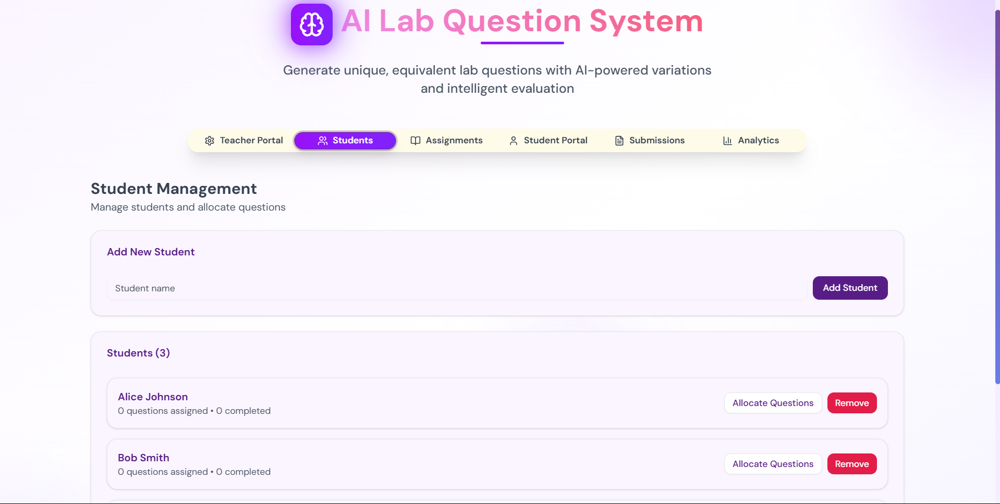

# AI Lab Question System

An intelligent platform designed to revolutionize laboratory education through AI-powered question generation, student management, and automated evaluation. Perfect for educators looking to create unique, equivalent lab questions and streamline the assessment process.

## 🌟 Features

### 🎯 AI-Powered Question Generation
- **Intelligent Variations**: Generate 4 unique but equivalent variations of any lab question
- **Bulk Question Creation**: Create multiple unique questions for different students
- **Smart Categories**: Organize questions by subject, difficulty, and category
- **Uniqueness Scoring**: AI-powered assessment of question uniqueness

### 👥 Student Management
- **Student Registration**: Easy student onboarding and management
- **Question Allocation**: Automatic or manual question assignment to students
- **Progress Tracking**: Monitor student submissions and completion status

### 🤖 Automated Evaluation
- **AI-Powered Grading**: Intelligent evaluation of student answers
- **Detailed Feedback**: Constructive feedback with strengths and improvement areas
- **Bias-Free Assessment**: Fair and consistent evaluation across all submissions

### 📊 Assignment System
- **Custom Assignments**: Create structured assignments with multiple questions
- **Due Date Management**: Set and track assignment deadlines
- **Submission Tracking**: Monitor student progress and completion rates

### 🎨 Modern UI/UX
- **Glass Morphism Design**: Beautiful, modern interface with smooth animations
- **Responsive Layout**: Works seamlessly across desktop and mobile devices
- **Dark/Light Theme**: Adaptive theming for better user experience

## � Screenshots

### Dashboard Overview

*Main dashboard with question management and analytics*

### AI Question Generation

*AI-powered question generation with multiple variations*

### Student Portal

*Clean student interface for accessing assigned questions*

### Student Management

*Comprehensive student management and progress tracking*

## �🚀 Technology Stack

- **Frontend**: Next.js 15, React 19, TypeScript
- **Styling**: Tailwind CSS with custom animations
- **UI Components**: Radix UI primitives with shadcn/ui
- **AI Integration**: Together AI (Llama 3.3 70B Instruct Turbo)
- **State Management**: React hooks and context
- **Package Manager**: pnpm

## 📁 Project Structure

```
├── app/
│   ├── globals.css          # Global styles and animations
│   ├── layout.tsx           # Root layout component
│   ├── page.tsx             # Main application component
│   └── loading.tsx          # Loading component
├── components/
│   ├── ui/                  # Reusable UI components
│   └── theme-provider.tsx   # Theme context provider
├── lib/
│   ├── ai-service.ts        # AI integration service
│   └── utils.ts             # Utility functions
├── public/                  # Static assets
└── styles/                  # Additional stylesheets
```

## 🎓 How It Works

### For Educators (Teacher View)
1. **Question Creation**: Input your original lab question with metadata (subject, difficulty, category)
2. **AI Generation**: Choose between single question variations or bulk unique questions
3. **Student Management**: Register students and allocate questions automatically or manually
4. **Progress Monitoring**: Track student submissions and review AI evaluations

### For Students (Student View)
1. **Question Access**: View allocated questions with clear instructions
2. **Answer Submission**: Submit detailed answers through the intuitive interface
3. **Instant Feedback**: Receive AI-powered evaluation with detailed feedback
4. **Progress Tracking**: Monitor your submission history and scores

## 🛠️ Installation & Setup

### Prerequisites
- Node.js 18+ 
- pnpm (recommended) or npm

### Installation

1. **Clone the repository**
   ```bash
   git clone https://github.com/ManvendraSinghTanwar/AI-Lab-Question-System.git
   cd AI-Lab-Question-System
   ```

2. **Install dependencies**
   ```bash
   pnpm install
   # or
   npm install
   ```

3. **Set up environment variables**
   ```bash
   # Create .env.local file and add your Together AI API key
   echo "TOGETHER_AI_API_KEY=your_api_key_here" > .env.local
   ```

4. **Run the development server**
   ```bash
   pnpm dev
   # or
   npm run dev
   ```

5. **Open your browser**
   Navigate to `http://localhost:3000` to see the application

### Production Build

```bash
pnpm build
pnpm start
```

## 🎯 Use Cases

### Educational Institutions
- **Laboratory Courses**: Generate unique questions for chemistry, physics, biology labs
- **Practical Exams**: Create equivalent but different questions for fair assessment
- **Student Practice**: Provide varied practice questions for better learning

### Research Labs
- **Training Programs**: Standardized question sets for new researchers
- **Skill Assessment**: Evaluate understanding of lab procedures and concepts
- **Documentation**: Maintain organized question banks for different experiments

### Online Learning Platforms
- **Course Content**: Generate diverse question sets for online lab simulations
- **Assessment Tools**: Automated evaluation reduces instructor workload
- **Personalized Learning**: Each student gets unique questions for better engagement

## 🔧 Configuration

### AI Service Configuration
The system uses Together AI's Llama 3.3 70B model. You can modify the AI service in `lib/ai-service.ts`:

```typescript
// Change the model or API endpoint
private model = "meta-llama/Llama-3.3-70B-Instruct-Turbo"
private baseUrl = "https://api.together.xyz/v1"
```

### Customization Options
- **Question Categories**: Modify categories in the question generator form
- **Difficulty Levels**: Adjust difficulty options (Easy, Medium, Hard)
- **UI Themes**: Customize colors and animations in the CSS files
- **Evaluation Criteria**: Modify AI prompts for different evaluation standards

## 🤝 Contributing

We welcome contributions! Please follow these steps:

1. Fork the repository
2. Create a feature branch (`git checkout -b feature/amazing-feature`)
3. Commit your changes (`git commit -m 'Add amazing feature'`)
4. Push to the branch (`git push origin feature/amazing-feature`)
5. Open a Pull Request

## 📝 License

This project is licensed under the MIT License - see the [LICENSE](LICENSE) file for details.

## 🙋‍♂️ Support

If you encounter any issues or have questions:
- Open an issue on GitHub
- Contact: [ManvendraSinghTanwar](https://github.com/ManvendraSinghTanwar)

## 🚀 Future Enhancements

- [ ] Database integration for persistent storage
- [ ] Multi-language question support
- [ ] Advanced analytics and reporting
- [ ] Integration with LMS platforms
- [ ] Question bank import/export functionality
- [ ] Real-time collaboration features

---

**Made with ❤️ by Manvendra Singh Tanwar for better education through AI**
